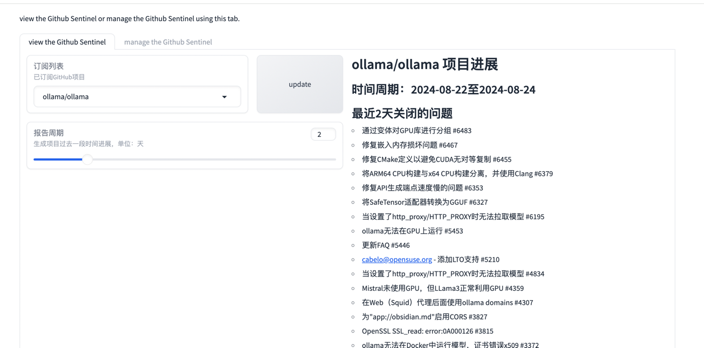
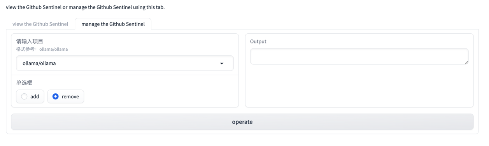
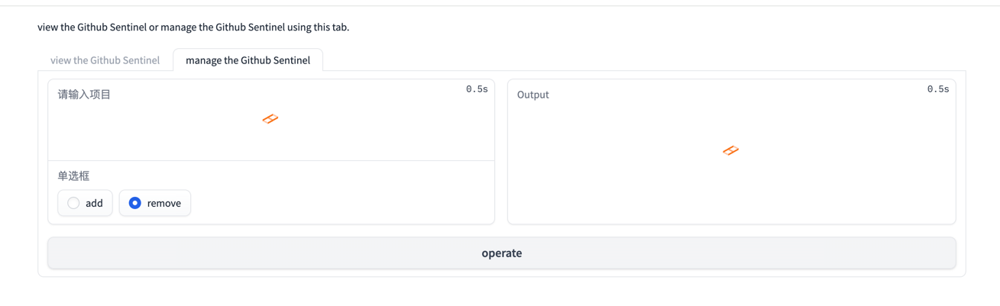
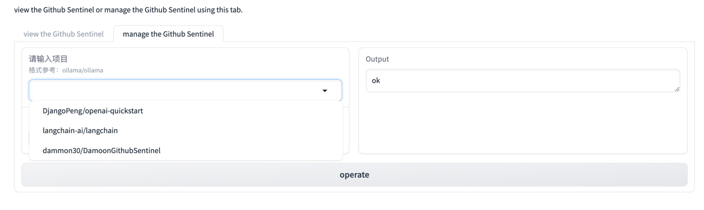

### 1、与chatGpt深度对话，尝试使用System role 提升报告质量和稳定性
尝试了两种方式：
见代码：https://github.com/damoon30/DamoonGitHubSentinel/blob/v0.4.1/src/llm.py

第一种
```python
def generate_daily_report(self, markdown_content):
    try:
        response = self.client.chat.completions.create(
            model="gpt-4o",
            messages=[
                {"role": "system", "content": self.system_prompt},
                {"role": "user", "content": markdown_content}
            ]
        )
        LOG.debug("GPT response: {}", response)
        return response.choices[0].message.content
    except Exception as e:
        LOG.error("An error occurred while generating the report: {}", e)
        raise
``` 
第二种：使用langchain中ChatPromptTemplate 和 LLMChain
```python
from langchain.chat_models import ChatOpenAI
import os
from langchain_core.prompts import ChatPromptTemplate

chat = ChatOpenAI(api_key=os.environ['OPENAI_API_KEY'], base_url=os.environ['OPENAI_API_BASE'])
def generate_report_chat_langchain(self, markdown_content):
    try:
        # 初始化总结模型
        # 创建 ChatPromptTemplate
        template = ChatPromptTemplate([
            ("system", f"You are a helpful AI bot. Your name is Carl. follow the rules to answer {self.system_prompt}"),
            ("human", "{user_input}"),
        ])

        chain = template | self.chat
        response = chain.invoke(markdown_content)
        LOG.info(response)
        return response.content
    except Exception as e:
        LOG.error("langchain error", e)
        raise
```


### 2、联系gradio基础组件和功能，尝试修改v0.4.1的布局
见代码：

```markdown

with gr.Blocks() as demo:
    gr.Markdown("view the Github Sentinel or manage the Github Sentinel using this tab.")
    with gr.Tab("view the Github Sentinel"):
        with gr.Row():
            with gr.Column():
                with gr.Row():
                    view_input1 = gr.Dropdown(choices=list_subscriptions, label="订阅列表",
                                              info="已订阅GitHub项目", scale=3)
                    update_button = gr.Button("update", scale=0, size="sm")
                view_input2 = gr.Slider(value=2, minimum=1, maximum=7, step=1, label="报告周期",
                                        info="生成项目过去一段时间进展，单位：天")
            with gr.Column():
                view_output1 = gr.Markdown()
                view_output2 = gr.File(label="下载报告")
        view_button = gr.Button("view")
    with gr.Tab("manage the Github Sentinel"):
        with gr.Row():
            with gr.Column():
                project_name = gr.Dropdown(choices=list_subscriptions, label="请输入项目",
                                           info="格式参考：ollama/ollama", allow_custom_value=True)
                operate = gr.Radio(["add", "remove"])
            image_output = gr.Textbox(label="Output")
        image_button = gr.Button("operate")

    view_button.click(export_progress_by_date_range, inputs=[view_input1, view_input2],
                      outputs=[view_output1, view_output2])
    update_button.click(refresh_dropdown, outputs=view_input1)
    image_button.click(operate_with_subscription, inputs=[project_name, operate], outputs=image_output)
    image_button.click(refresh_dropdown, outputs=project_name)

```

采用gr.Blocks方式去渲染布局   
* 在Tab=view the github Sentinel下支持将项目生成报告  

* 在Tab=manage the github Sentinel下支持增加和删除项目，并支持下拉框的动态更新




