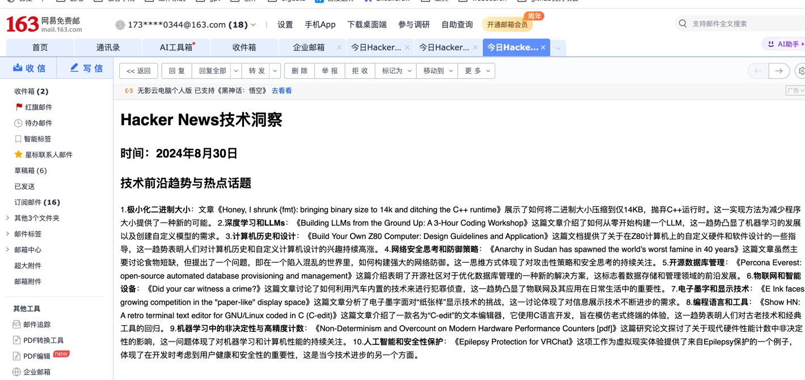

### 1、在 GitHubSentinel v0.5 基础上，扩展实现 Hacker News 趋势报告生成。实现优先级：Daemon（Required） > Graido > Command

### 2、[可选] 扩展 GitHubSentinel v0.6，使用 Ollama 私有化部署的大模型服务，完成作业 1

1、本地部署Llama3.1模型，使用该模型总结HackerNew 上的内容， [代码查看](https://github.com/damoon30/DamoonGitHubSentinel/blob/master/src/llm.py)

